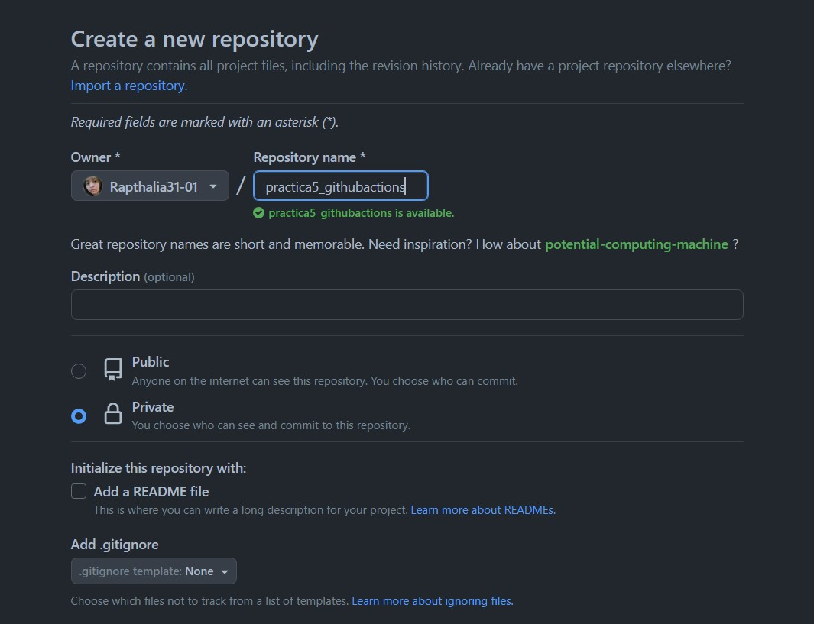
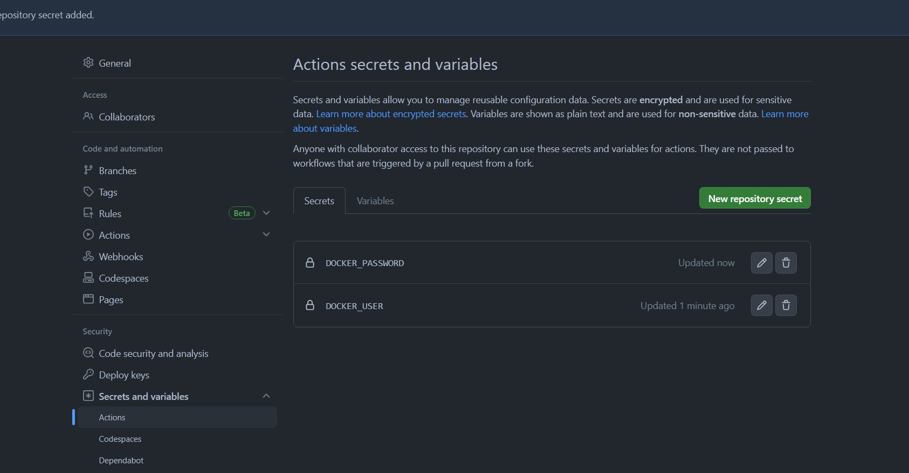
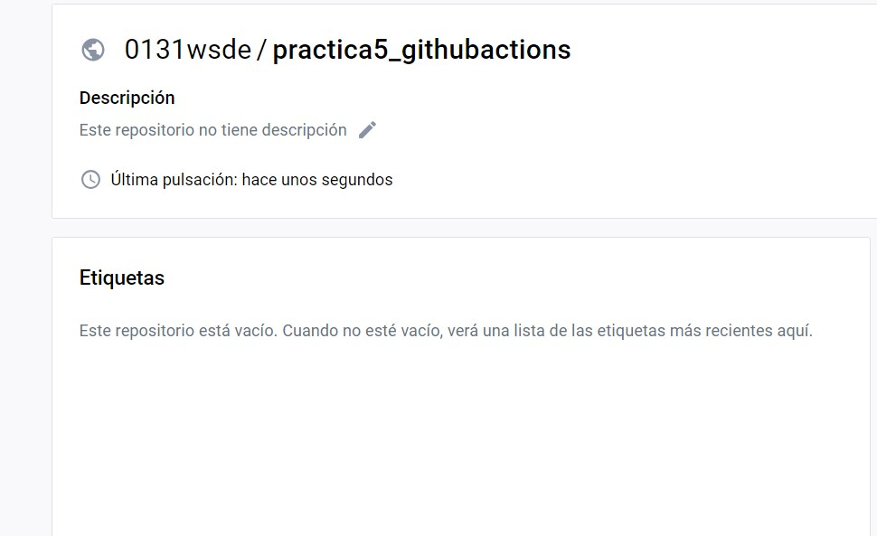
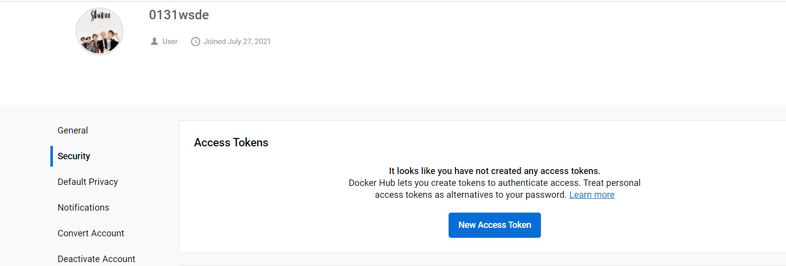
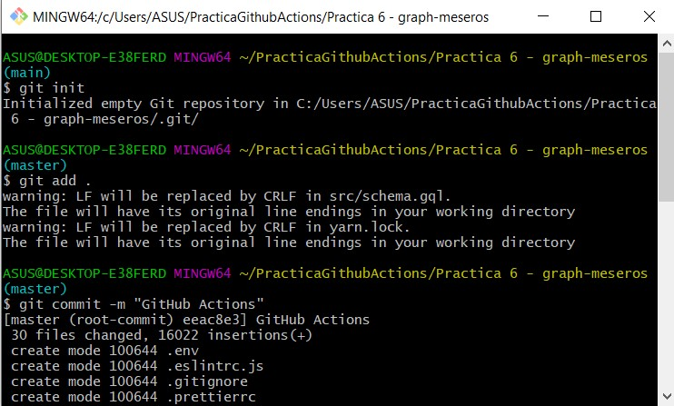
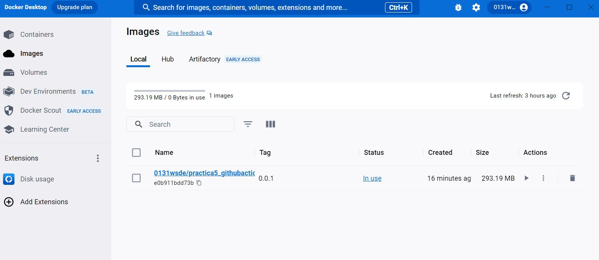
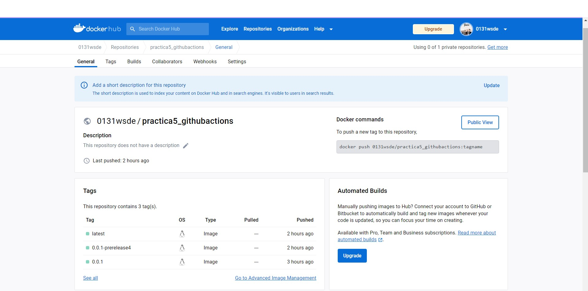
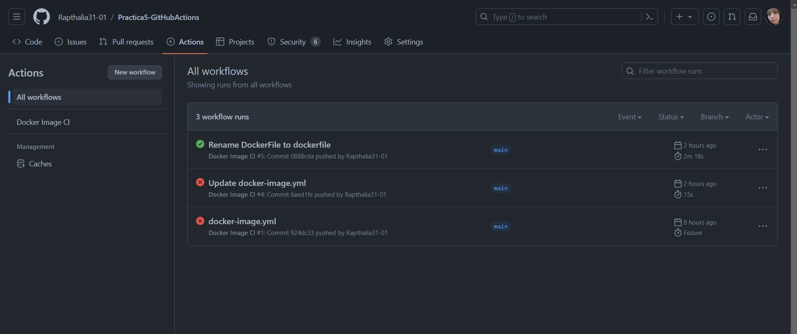
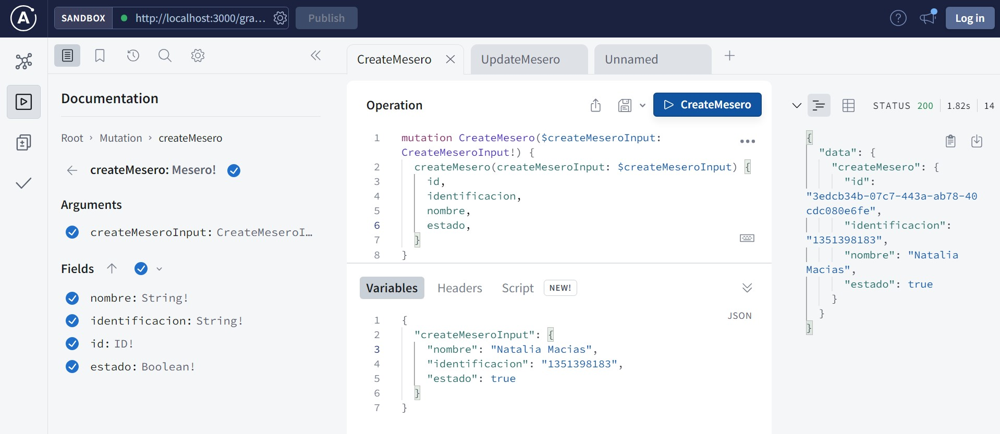

### Práctica Deploy en Dockers aplicando Github Actions

* Creación de repositorio público

* Creación de los Secrets Docker_User y Docker_Password en la Plataforma GITHUB

* creamos el repositorio a utilizar 

* realizamos un token en Docker (con el nombre Github-Actions) para que pueda ser utilizada en GitHub.

* subimos el codigo de Api rest con  GraphQL

* creacion de la imagen de version 0.0.1 

* se ejecuta varias versiones luego de haber realizado el deploy

* verificacion de que el api rest se encuentra funcionando

